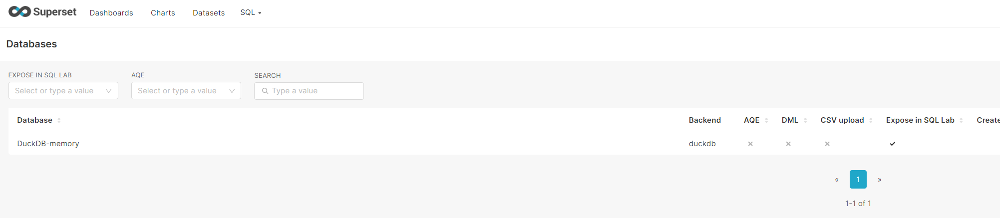
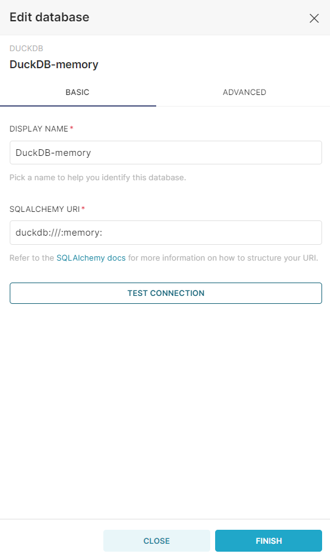
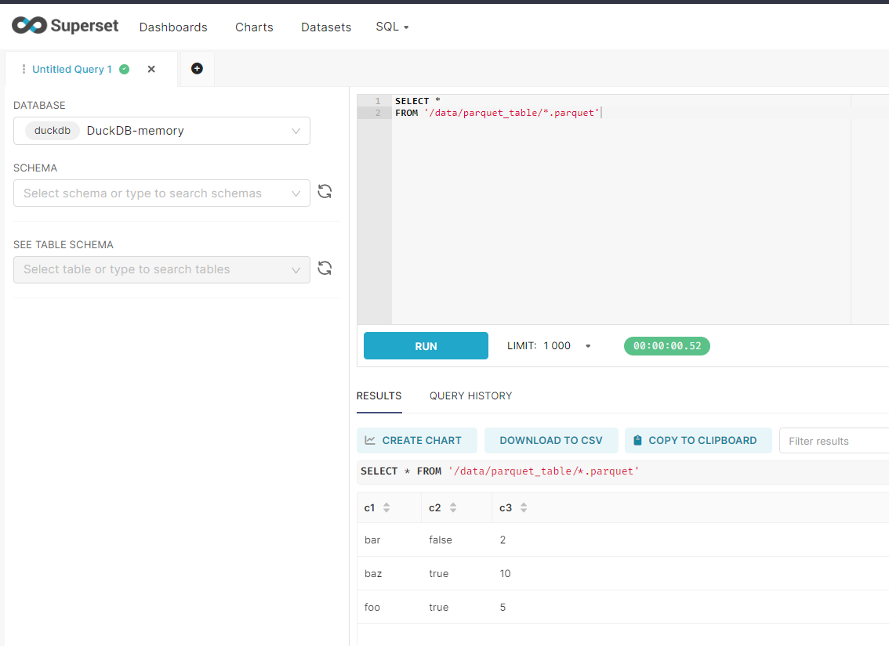

# Apache Superset – DuckDB
This repo presents a minimal setup to read `Parquet`, `JSON`, and `CSV` files with Apache Superset. Using an _in-memory_ DuckDB database, a live data connection is made between Superset and a filesystem.

# Custom Docker image
Execute the steps below to setup a local Apache Superset instance—with DuckDB support—using Docker.

## Build the image
```Shell
docker build -t jorritsandbrink/superset-duckdb docker
```

## Run the container
```Shell
docker run -d -p 8080:8088 \
    -e "SUPERSET_SECRET_KEY=your_secret_key" \
    --mount type=bind,source=/$(pwd)/data,target=/data \
    --name superset-duckdb \
    jorritsandbrink/superset-duckdb
```
> Note: the local `/data` folder is mounted to make the data files accessible from within the container.
## Setup Superset
```Shell
./docker/setup.sh
```
This includes creating an admin user and configuring a DuckDB database connection.

## Navigate to UI
Go to http://localhost:8080/login/ and login with `username=admin` and `password=admin`.

## Check database connection
Go to _Database Connections_ (http://localhost:8080/databaseview/list/) to validate the database connection has been created:



Click the _Edit_ button to see the connection details:



SQLAlchemy URI:
```
duckdb:///:memory:
```

Click `TEST CONNECTION` and make sure you see this popup message:


# Querying files from Superset using DuckDB
Go to _SQL Lab_ (http://localhost:8080/sqllab/) to query `Parquet`, `JSON`, or `CSV`, files as follows:



The queries use a glob syntax to read multiple files as documented on https://duckdb.org/docs/data/multiple_files/overview.html.

## Parquet
```sql
SELECT *
FROM '/data/parquet_table/*.parquet'
```

## JSON
```sql
SELECT *
FROM '/data/json_table/*.json'
```

## CSV
```sql
SELECT *
FROM '/data/csv_table/*.csv'
```

# References
-  [Portable Data Stack](https://github.com/cnstlungu/portable-data-stack-dagster/tree/main)
- [Preparing Apache Superset to working with Delta Lake, DuckDB, Prophet, Python LDAP Active Directory, Jinja and MS-SQL driver using Ubuntu](https://medium.com/@syarifz.id/preparing-apache-superset-to-working-with-delta-lake-duckdb-prophet-python-ldap-active-d9da7a9a68c3)
- [Create DuckDB Connection and Dataset using Delta Lake Parquet File in Apache Superset](https://medium.com/@syarifz.id/create-duckdb-connection-and-create-dataset-using-parquet-file-in-apache-superset-8765e5772342)
